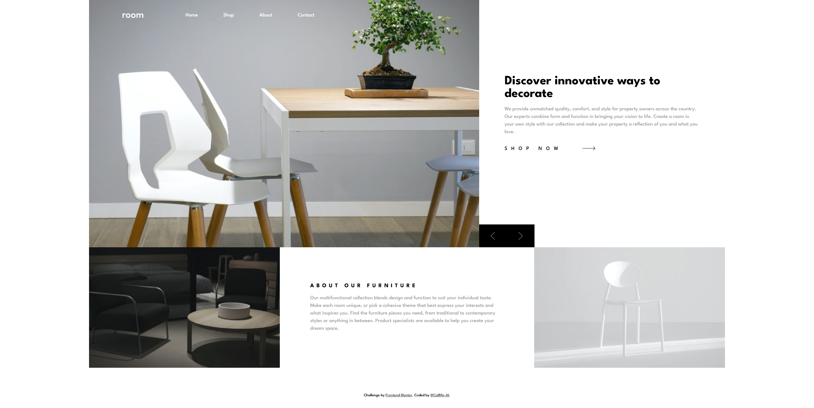

# Frontend Mentor - Room homepage solution

This is a solution to the [Room homepage challenge on Frontend Mentor](https://www.frontendmentor.io/challenges/room-homepage-BtdBY_ENq). Frontend Mentor challenges help you improve your coding skills by building realistic projects.

## Table of contents

- [Overview](#overview)
  - [The challenge](#the-challenge)
  - [Screenshot](#screenshot)
  - [Links](#links)
- [My process](#my-process)
  - [Built with](#built-with)
  - [What I learned](#what-i-learned)
  - [Continued development](#continued-development)
  - [Useful resources](#useful-resources)
- [Author](#author)

## Overview

### The challenge

Users should be able to:

- View the optimal layout for the site depending on their device's screen size
- See hover states for all interactive elements on the page
- Navigate the slider using either their mouse/trackpad or keyboard

### Screenshot

### Links

- Solution URL: [Github repo](https://github.com/CallMe-AL/fementor-room-homepage)
- Live Site URL: [Github site](https://callme-al.github.io/fementor-room-homepage/)

## My process

### Built with

- Semantic HTML5 markup
- CSS custom properties
- Flexbox
- CSS Grid
- Mobile-first workflow

### What I learned

Great practice to get back in the swing of web development after not having had much time to code recently. I got a better feel of when to use grid over flexbox, and how to dynamically space content within flex/grid depending on the viewport size.

I learned more about how to style SVGs, too, and also learned a bit more about what they are in general.

### Continued development

I want to continue to practice using grid and flex in a more dynamic way. I'm comfortable using each for a page that doesn't change much, but I feel writing code that would more easily change spacing as the viewport changes would reduce the amount of CSS I write (i.e., avoid using so many media queries). It may also help me understand these layouts more in-depth, too!

I also want to keep practicing styling SVGs, mostly starting with changing colors as a user interacts with a page.

### Useful resources

- [MDN article on flex item ratios](https://developer.mozilla.org/en-US/docs/Web/CSS/CSS_Flexible_Box_Layout/Controlling_Ratios_of_Flex_Items_Along_the_Main_Ax) - For help making flexbox items more dynamic.
- [Codepen to change SVG color with CSS](https://codepen.io/sosuke/pen/Pjoqqp) - Barrett Sonntag is a saint for making this.

## Author

- Website - [Portfolio](https://callme-al.github.io/portfolio/)
- Frontend Mentor - [@CallMe-Al](https://www.frontendmentor.io/profile/CallMe-AL)
